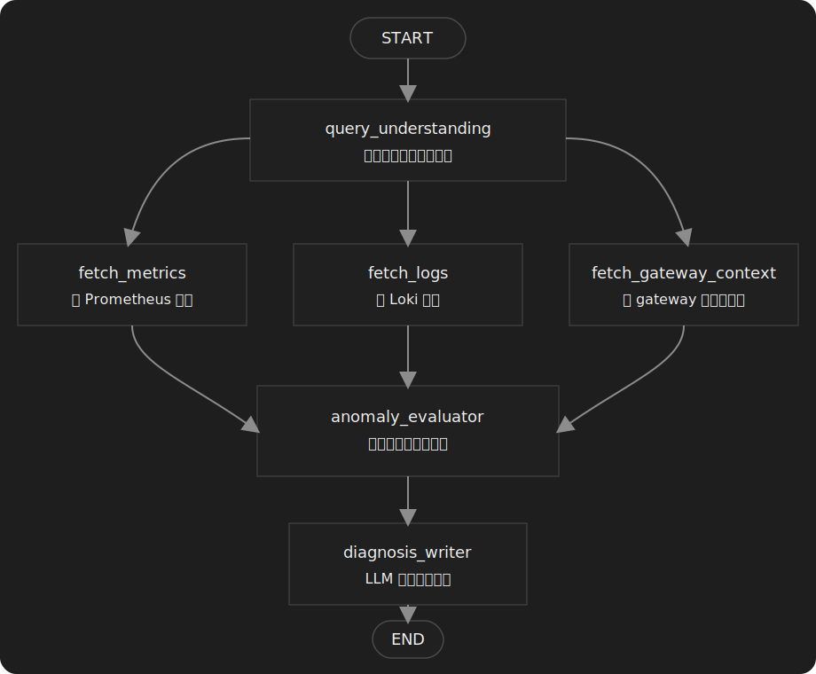

# 运维智能体服务

`ops-agent-service` 是设备网关项目中的一个基于 LangGraph 的诊断服务。

## 功能说明

- 分析流量波动是正常变化还是异常现象
- 结合指标、日志和网关连接状态解释告警原因
- 提供便于通过 Swagger 调试的 HTTP API，适合联调和面试演示
- 将每次分析结果持久化到 SQLite，便于回放和审计

## 诊断流程

相比直接看 `workflow.py` 里的节点函数，下面这张图更适合快速理解整条 LangGraph 编排链路：



- `query_understanding` 先把自然语言问题规范化
- `fetch_metrics`、`fetch_logs`、`fetch_gateway_context` 三路并行取证
- `anomaly_evaluator` 汇总证据并做规则判断
- `diagnosis_writer` 基于证据和判断结果生成最终诊断

## 技术栈

- Python 3.11+
- FastAPI
- LangGraph
- Pydantic
- Prometheus HTTP API
- Loki HTTP API
- 兼容 OpenAI 接口的聊天模型

## 接口列表

- `POST /agent/analyze`
- `POST /agent/explain-alert`
- `GET /agent/health`
- `GET /docs`

## 本地启动

```bash
python -m venv .venv
.venv\Scripts\activate
pip install -e .[dev]
copy .env.example .env
uvicorn app.main:app --reload --port 8010
```

## 说明

- 服务使用 `LangGraph` 做有状态编排，但整体流程保持轻量，便于理解和扩展。
- 模型层支持兼容 OpenAI 的接口，后续可以方便切换到 OpenAI 或其他兼容网关。
- 当模型不可用时，服务会退化为确定性分析逻辑，而不是返回臆造结果。

## 面试资料

- 中文项目说明与面试指南：`项目说明与面试指南.md`
- 中文三分钟面试讲稿：`三分钟面试讲稿.md`
- 中文架构与流程图：`架构与流程图.md`
- 中文简历项目描述：`简历项目描述.md`
- 中文模拟面试问答：`模拟面试问答.md`
