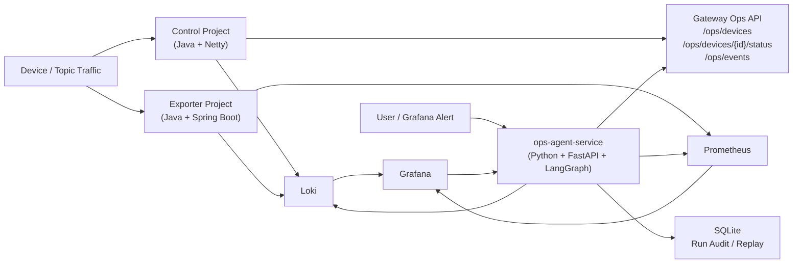
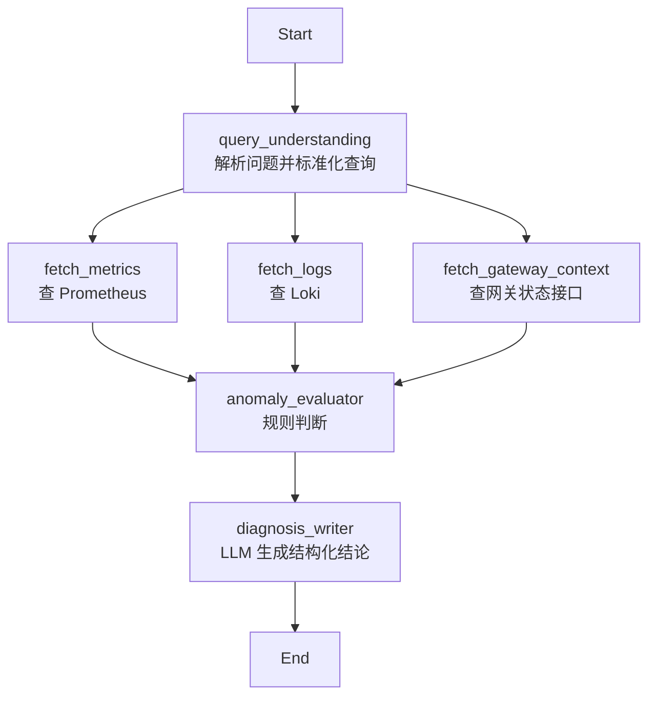
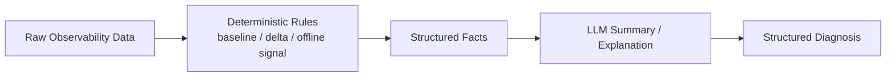

# Device Gateway 诊断 Agent 架构图与流程图

## 1. 总体架构图

### 讲解重点

- 原有 Java 网关继续负责主链路通信，不被 Agent 干扰
- Agent 是旁路服务，只读接入指标、日志和网关状态
- Grafana 负责展示和告警，Agent 负责诊断和解释
- 每次诊断结果会落库，支持审计和回放

---

## 2. LangGraph 工作流图

### 讲解重点

- 这是一个“单图、多节点、弱 agent 化”的设计
- 不是一上来就做复杂多 Agent
- 先把诊断主链路打通，再考虑扩展

---

## 3. 为什么这样拆节点

### `query_understanding`

- 把自然语言问题转成结构化查询条件
- 提取 `device_id`、`topic_id`、时间范围
- 统一生成 PromQL 和 LogQL

### `fetch_metrics`

- 查询当前窗口流量
- 查询前一天同窗口 baseline
- 产出结构化 metrics evidence

### `fetch_logs`

- 查询同一时间窗口内的关键日志
- 按错误关键词抽取相关日志
- 产出结构化 logs evidence

### `fetch_gateway_context`

- 获取设备在线状态
- 获取最近连接/断开事件
- 提供领域上下文

### `anomaly_evaluator`

- 使用规则做第一层判断
- 避免大模型直接决定是否异常
- 输出 assessment 和置信度

### `diagnosis_writer`

- 基于 assessment 和 evidence 做最终解释
- 输出结构化 JSON
- 如果 LLM 不可用则走 fallback

---

## 4. 为什么要“规则优先，LLM 后置”

### 讲解重点

- LLM 擅长总结，不擅长保证底层事实判断绝对稳定
- 先用规则得出“事实层结论”
- 再让模型基于事实做解释
- 这样能降低幻觉、增强可解释性、提高稳定性

---

## 5. 面试时可以怎么配合图来讲

### 先讲总体架构图

建议表达：

“左边是原有网关和观测体系，右边是我新增的诊断 Agent。核心设计原则是 Agent 旁路化，不进入实时控制主链路。”

### 再讲 LangGraph 流程图

建议表达：

“我没有把诊断写成一大段 prompt，而是拆成几个明确节点，每个节点对应一个清晰责任，这样后续调试、扩展和解释都更容易。”

### 最后讲规则优先图

建议表达：

“这里我做了一个关键设计，就是让规则先判断，LLM 后总结。这样能减少 AI 幻觉，同时保留自然语言解释能力。”
